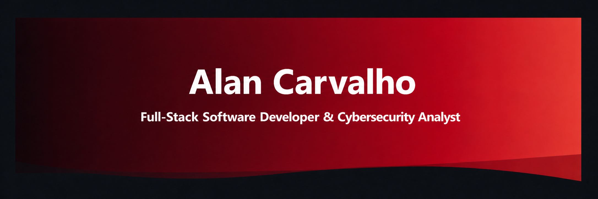
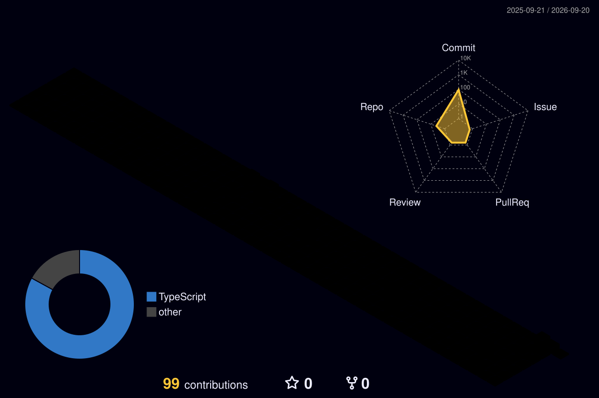

<div align="center">
  
</div>

<div align="center">
  <a href="https://git.io/typing-svg">
    
  </a>
</div>

<div align="center">
  <a href="https://github.com/Vnxcarvalho">
    
  </a>
  <a href="https://www.linkedin.com/in/alan-carvalho-/">
    
  </a>
  <a href="mailto:alanviniciuscarvalho@gmail.com">
    
  </a>
  <a href="https://carvalho-new-portfolio.vercel.app/">
    
  </a>
</div>

<br />

<div align="center">
  
</div>

---

## 👨‍💻 About me

```ts
const alanCarvalho = {
  role: "Software Developer",
  education: "Análise e Desenvolvimento de Sistemas",
  location: "Curitiba, PR — Brasil",
  interests: [
    "Desenvolvimento web",
    "Interfaces modernas",
    "Soluções escaláveis",
    "Aprendizado contínuo",
  ],
  mindset: "Tecnologia com propósito, código com qualidade.",
  availableFor: "Novos desafios e oportunidades profissionais",
} as const;
```

Sou estudante de **Análise e Desenvolvimento de Sistemas** em Curitiba/PR, focado em transformar desafios em produtos digitais claros, eficientes e bem construídos. Busco evoluir continuamente, colaborar com times de alta performance e criar soluções que combinem tecnologia, experiência e impacto real.

---

## 🧰 Digital Workstation

<div align="center">
  
  
  
  
</div>

---

## 📊 GitHub Analytics

<div align="center">
  
  
</div>

<div align="center">
  
</div>

<div align="center">
  
</div>

> As estatísticas são geradas por serviços externos e refletem apenas os dados públicos disponíveis no GitHub.

---

## 🌌 Contributions in 3D

<div align="center">
  
</div>

---

## 🐍 Contribution Snake

<div align="center">
  <picture>
    <source media="(prefers-color-scheme: dark)" srcset="https://raw.githubusercontent.com/Vnxcarvalho/Vnxcarvalho/output/github-contribution-grid-snake-dark.svg" />
    <source media="(prefers-color-scheme: light)" srcset="https://raw.githubusercontent.com/Vnxcarvalho/Vnxcarvalho/output/github-contribution-grid-snake.svg" />
    
  </picture>
</div>

---

## 🤝 Vamos construir algo incrível?

Estou aberto a conexões, colaboração em projetos e oportunidades para crescer profissionalmente enquanto entrego soluções de qualidade.

<div align="center">
  <a href="https://www.linkedin.com/in/alan-carvalho-/">LinkedIn</a>
  <span> • </span>
  <a href="mailto:alanviniciuscarvalho@gmail.com">E-mail</a>
  <span> • </span>
  <a href="https://carvalho-new-portfolio.vercel.app/">Portfólio</a>
</div>

<br />

<div align="center">
  
</div>
